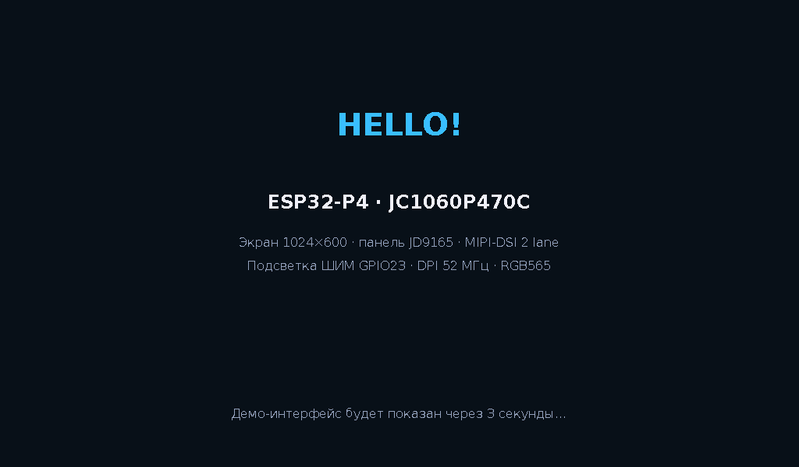
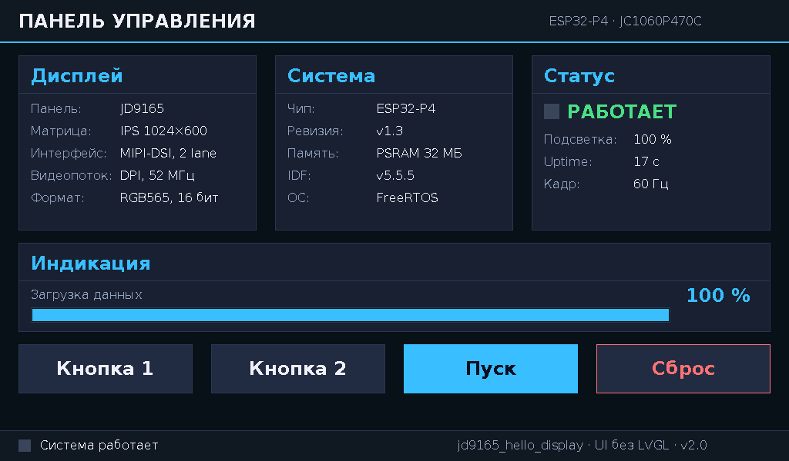

# jd9165_hello_display — минимальный тест дисплея и демо-UI 1024×600

> **Что делает:** включает дисплей платы Guition JC1060P470C_I_W_Y, показывает
> сплэш с приветствием, затем собирает на экране демо-интерфейс (панели,
> кнопки, полоса прогресса, статус-бар) и запускает живую анимацию.
> **Без LVGL, тачскрина, камеры, Wi-Fi и звука** — UI нарисован напрямую во
> фреймбуфер примитивами из `ui.c` и ГОТОВЫМИ шрифтами DejaVu Sans
> (свободный TTF-шрифт, конвертированный в C-массивы, — кириллица уже включена).

Наименование проекта расшифровывается так:
`jd9165` — экранная микросхема (драйвер матрицы), `hello_display` — назначение
(приветствие на дисплее + демонстрация построения UI).

Что на экране после загрузки:

1. **Сплэш (3 секунды)** — «HELLO!», сведения о плате и дисплее.
2. **Демо-интерфейс** — тёмная тема: шапка «ПАНЕЛЬ УПРАВЛЕНИЯ», три панели
   свойств («Дисплей», «Система», «Статус»), панель «Индикация» с полосой
   прогресса, четыре кнопки в трёх стилях, статус-бар с мигающим индикатором.
3. **Анимация (10 Гц)** — полоса прогресса проходит 0→100 %, счётчик
   «Uptime» считает секунды, индикаторы мигают раз в секунду. Статическая
   часть кадра не перерисовывается — мерцания нет.

Скриншоты ожидаемой картинки сняты с эмуляции фреймбуфера на ПК
(проверка вёрстки до прошивки железа):





Текст рисуется шрифтами DejaVu Sans (16 px обычный, 24 и 40 px — Bold):
это «готовые» шрифты, конвертированные один раз скриптом `tools/make_font.py`
в массивы C. Никаких библиотек рендеринга на устройстве не нужно.

## Как это работает (кратко о выводе на дисплей)

```
ESP32-P4 ── MIPI-DSI, 2 data-lane, 750 Мбит/с ──> JD9165 ──> матрица 1024×600
```

1. **Питание DSI-PHY** — внутренний LDO ESP32-P4, канал 3, 2500 мВ.
2. **Шина MIPI-DSI** — создаётся через `esp_lcd_new_dsi_bus()`.
3. **Командный канал DBI** — по нему в панель отправляются команды
   (8 бит команда / 8 бит параметр).
4. **Видеоканал DPI** — по нему DMA непрерывно передаёт содержимое
   фреймбуфера (52 МГц, RGB565) на панель.
5. **Драйвер панели** — компонент `espressif/esp_lcd_jd9165` (реестр
   компонентов Espressif, v2.0.2) выполняет ~50 vendor-команд
   инициализации, специфичных для матрицы Guition, после чего экран
   переходит из сна в рабочий режим.
6. **Подсветка** — ШИМ (LEDC) на GPIO23, 20 кГц; включается на 100 %
   после отрисовки текста. Сброс панели — GPIO0.
7. **Фреймбуфер** — 1024 × 600 × 2 байта = 1,2 МБ, размещается в PSRAM
   (во внутреннюю SRAM не поместился бы). После завершения `app_main()`
   DMA сам бесконечно транслирует фреймбуфер на экран — картинка
   остаётся без какого-либо кода.

## Требования

* ESP-IDF **v5.3 или новее** (проверено на v5.5.5).
* При первой сборке нужен интернет — менеджер компонентов скачает
  драйвер `esp_lcd_jd9165`.

## Как скачать

**Кнопка Code → Download ZIP** на странице этой ветки, либо:

```bash
git clone -b jd9165_hello_display https://github.com/megavatt05/ESP32P4-JC1060P470C-I_W_Y.git jd9165_hello_display
cd jd9165_hello_display
```

## Как собрать и прошить

Замените `COM10` на фактический порт платы:

```bash
idf.py set-target esp32p4
idf.py -p COM10 flash monitor
```

Ожидаемый журнал (сокращённо):

```
I (xxx) hello_display: jd9165_hello_display — минимальный тест дисплея 1024x600
I (xxx) hello_display: MIPI DSI PHY питание включено (LDO канал 3, 2500 мВ)
I (xxx) gpio: GPIO[0]| InputEn: 0| ...  (сброс панели)
I (xxx) hello_display: MIPI-DSI шина создана (2 lane, 750 Мбит/с)
I (xxx) hello_display: Панель JD9165 инициализирована (50 vendor-команд)
I (xxx) hello_display: Сплэш нарисован во фреймбуфер (PSRAM), включаю подсветку
I (xxx) hello_display: Демо-интерфейс отрисован; запускаю цикл анимации (10 Гц)
```

## Структура проекта

```
.
├── CMakeLists.txt            # Корневой сценарий сборки
├── sdkconfig.defaults        # Настройки: чип, флеш, PSRAM, ветка ревизий < 3.0
├── .gitignore                # Исключения git (на русском)
├── README.md                 # Этот документ
├── tools/
│   └── make_font.py          # Конвертер готового TTF (DejaVu Sans) в C-массивы
└── main/
    ├── main.c                # Инициализация дисплея, сплэш, цикл анимации
    ├── ui.c / ui.h           # Примитивы UI: заливка, рамки, текст, панели, кнопки
    ├── ui_demo.c / ui_demo.h # Демо-экран 1024×600: компоновка + анимация
    ├── ui_font_sans16.c      # Готовый шрифт DejaVu Sans 16 px (кириллица)
    ├── ui_font_sans24b.c     # Готовый шрифт DejaVu Sans Bold 24 px
    ├── ui_font_sans40b.c     # Готовый шрифт DejaVu Sans Bold 40 px
    ├── CMakeLists.txt        # Регистрация всех исходников компонента main
    └── idf_component.yml     # Зависимость espressif/esp_lcd_jd9165 ^2.0.2
```

## Как построить UI для экрана 1024×600 (объяснение подхода)

Экран — это просто массив из 1024 × 600 пикселей по 2 байта (RGB565) в
PSRAM. DMA канала DPI непрерывно транслирует его на панель, поэтому
«вывести что-то» = «изменить пиксели во фреймбуфере». Интерфейс строится
в четыре слоя:

**Слой 1. Примитивы (`ui.c`).** Всё рисование сводится к пяти функциям:
`ui_fill_rect` (заливка), `ui_frame_rect` (рамка), `ui_hline`/`ui_vline`
(линии) и `ui_draw_text` (текст). Каждая сначала отсекается по границам
экрана — за фреймбуфер не запишешь даже кривыми координатами.

**Слой 2. Готовые шрифты (`ui_font_*.c` + `tools/make_font.py`).** Брать
шрифт вручную не нужно: скрипт берёт готовый TTF из системы (DejaVu Sans,
лицензия разрешает встраивание) и растеризует каждый символ в битовый
массив: 1 бит = 1 пиксель. Описание глифа — код Unicode, размеры, шаг
пера и смещения (`ui_glyph_t` в `ui.h`), рендер на устройстве — простая
побитовая развёртка в `ui_draw_char`. Текст читается как UTF-8 (функция
`ui_utf8_decode`), кириллица работает «из коробки». Чтобы добавить свой
шрифт — добавьте строку в список `FONTS` скрипта и запустите
`python3 tools/make_font.py` (нужен Pillow).

**Слой 3. Виджеты (`ui.c`, вторая половина).** Комбинации примитивов:
`ui_panel_draw` (панель с заголовком и разделителем), `ui_button_draw`
(кнопка трёх стилей: обычная, акцентная, «опасная»), `ui_progress_draw`
(полоса прогресса), `ui_kv_line` (пара «ключ: значение» с выравниванием
в колонку). Цвета заданы в `ui.h` палитрой тёмной темы (`UI_COL_*`).

**Слой 4. Компоновка и динамика (`ui_demo.c`).** Экран делится на
прямоугольники-зоны с полями 24 px и зазорами 24 px:

```
┌──────────────────────── шапка 1024×56 ────────────────────────┐
├─────────────┬─────────────┬─────────────┤  3 панели 309×228   │
│  Дисплей    │  Система    │  Статус     │                     │
├─────────────┴─────────────┴─────────────┤                     │
│  Индикация (прогресс 976×116)           │                     │
├─────────────────────────────────────────┤                     │
│  [Кнопка 1] [Кнопка 2] [Пуск] [Сброс]   │  кнопки 226×64      │
├─────────────────────────────────────────┤                     │
│  статус-бар 1024×40                     │                     │
└─────────────────────────────────────────┴─────────────────────┘
```

Главный принцип анимации: **статика рисуется один раз** (`ui_demo_draw`),
динамика — отдельной функцией `ui_demo_tick`, которая перерисовывает
только маленькие изменившиеся зоны (значение uptime, полосу и проценты,
мигающие индикаторы). `main.c` вызывает тик раз в 100 мс. Так как DMA
сам забирает фреймбуфер, никаких вызовов «перерисовать экран» не нужно.

Если понадобится полноценный UI с реальными обработчиками касаний —
в репозитории есть ветка `esp_brookesia_phone` (LVGL + ESP-Brookesia);
данный проект — низкоуровневая альтернатива без единой библиотеки.

## Что можно поменять (шпаргалка)

| Хочу | Где править |
|---|---|
| Тексты панелей | массивы `ui_kv_line(...)` в `ui_demo.c` |
| Цвета темы | define'ы `UI_COL_*` в `ui.h` |
| Другой шрифт/размер | список `FONTS` в `tools/make_font.py`, затем запуск скрипта |
| Расположение зон | константы `R_*` в начале `ui_demo.c` |
| Скорость анимации | период `vTaskDelay(100)` в `main.c` |
| Яркость подсветки | `backlight_set_percent(100)` — процент |
| Скорость обновления | `dpi_clock_freq_mhz` (52) и тайминги porch'ей |

## Устранение неполадок

| Симптом | Причина | Решение |
|---|---|---|
| Экран белый/чёрный, ошибки esp_lcd | Панель не получила vendor-команды | Проверьте, что `jd9165_gui_init_cmds` передана в `vendor_cfg.init_cmds` |
| Картинка есть, экран тёмный | Подсветка не включилась | Warning `ledc: GPIO 23 is not usable` на этой плате — известный; проверьте `backlight_set_percent(100)` вызывается |
| `esp_lcd_new_dsi_bus failed` | Нет питания DSI-PHY | Не удалён шаг LDO (канал 3, 2500 мВ) |
| Компонент jd9165 не найден | Нет интернета при первой сборке | Подключитесь к сети, повторите `idf.py build` |
| Ошибка выделения фреймбуфера | Отключён PSRAM | Проверьте `CONFIG_SPIRAM=y` в sdkconfig |

---

*Автор адаптации: megavatt05. Источники параметров: BSP вендора
(espressif__esp32_p4_function_ev_board, конфигурация 1024×600) и демо
`1-Demo/Demo_IDF` из основной ветки репозитория.*
